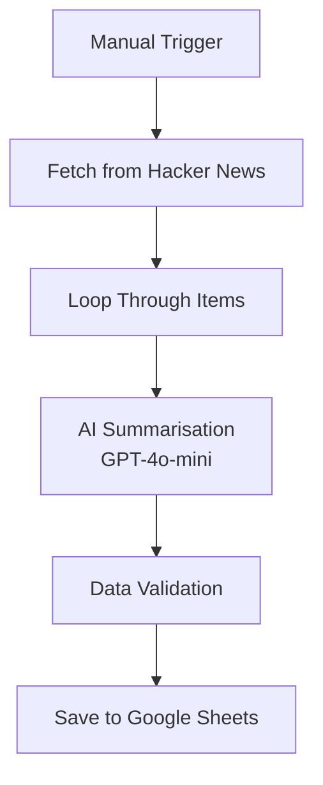

# AI-Powered News Aggregator | n8n Workflow

> **Automating content discovery with AI-powered summarisation and structured data extraction**

---

## 🎯 Project Overview

An automated workflow that fetches stories from Hacker News, generates AI-powered summaries, and logs curated results into Google Sheets for easy tracking and analysis.

**The Problem:** Staying on top of relevant industry news requires constant manual monitoring. Scanning headlines, filtering noise, and organising useful content takes significant daily effort.

**The Solution:** A no-code AI workflow that continuously collects relevant posts, processes them through GPT-4o-mini to create concise headlines, validates the data, and stores structured results in Google Sheets—creating a searchable, reusable news dataset with zero manual effort.

---

## 🚀 What This Demonstrates

### **AI Operations & Automation Engineering Skills**
- **End-to-end workflow design**: Manual trigger → API fetch → loop processing → LLM summarisation → data validation → spreadsheet storage
- **Prompt engineering**: Configured AI agent to generate concise 5-word headlines from verbose technical titles
- **Data pipeline design**: Structured extraction with validation to ensure consistent, clean outputs
- **Integration orchestration**: Connected Hacker News API, OpenAI GPT-4o-mini, and Google Sheets into a reliable pipeline

### **Operational Thinking**
This project applies the same operational mindset I've used across insurance analysis, community operations, and customer ops: **identify inefficiency → automate with AI → measure impact**.

---

## 🏗️ Architecture & Workflow

### **High-Level Flow**
```
Manual Trigger → Fetch from Hacker News → Loop Through Items → AI Summarisation → Data Validation → Save to Google Sheets
```

### **Workflow Diagram**


*Complete n8n workflow showing all nodes and connections*


### **Technical Components**

| Node | Technology | Function |
|------|------------|----------|
| **Manual Trigger** | `n8n-nodes-base.manualTrigger` | Initiates workflow execution |
| **HTTP Request** | Hacker News API | Fetches stories based on keyword searches |
| **Loop** | `n8n-nodes-base.splitInBatches` | Processes items sequentially with delays |
| **AI Agent** | `@n8n/n8n-nodes-langchain.agent` | GPT-4o-mini summarisation with structured output |
| **IF Node** | `n8n-nodes-base.if` | Validates data completeness |
| **Google Sheets** | `n8n-nodes-base.googleSheets` | Stores curated results |

### **AI Agent Output Structure**

The AI extracts and structures:
1. **Headline** - Concise 5-word summary of the original title
2. **URL** - Direct link to the content
3. **Date** - Publication timestamp

---

## 🧠 Prompt Engineering

### **Summarisation Strategy**
```
Task: Convert verbose or technical titles into short, high-signal headlines
Constraint: Five words or fewer
Output: Structured format suitable for dashboards, reports, or newsletters
```

### **Quality Controls**
- AI-powered output parser ensures consistent formatting
- Entries missing required fields are automatically skipped
- Configurable delays prevent API overload

---

## 📊 Results

| Metric | Value |
|--------|-------|
| **Output format** | Structured, searchable Google Sheets dataset |
| **Data quality** | Auto-validation skips incomplete entries |
| **Scalability** | Batch processing with rate limiting |
| **Customisation** | Keyword filters adjustable for any topic |

---

## 🛠️ Technical Stack

| Component | Technology | Purpose |
|-----------|-----------|---------|
| **Workflow Engine** | n8n (cloud) | Visual automation platform |
| **Data Source** | Hacker News API | Tech news aggregation |
| **LLM** | OpenAI GPT-4o-mini | Content summarisation |
| **Output Parser** | LangChain | Structured data extraction |
| **Storage** | Google Sheets API | Curated results repository |

---

## 🔧 Setup & Deployment

### **Prerequisites**
- n8n instance (cloud or self-hosted)
- OpenAI API key
- Google Cloud project with Sheets API enabled
- OAuth2 credentials for Google Sheets

### **Installation**

1. **Import Workflow**
```bash
   # In n8n: Settings → Import from File → Select workflow.json
```

2. **Configure Credentials**
   - OpenAI: Add API key in n8n credentials
   - Google Sheets: Complete OAuth2 flow

3. **Customise Keywords**
   - Edit the Hacker News fetch node to track topics of interest

4. **Activate & Test**
   - Run manually or set up scheduled triggers
   - Check Google Sheets for output

### **Customization Options**
- **Change data source**: Replace Hacker News with Reddit, RSS feeds, or other APIs
- **Adjust summarisation**: Modify AI prompt for different headline styles
- **Switch output destination**: Replace Google Sheets with Notion, Airtable, or database
- **Add scheduling**: Convert manual trigger to cron-based automation

---

## 🎓 Challenges & Solutions

| Challenge | Solution |
|-----------|----------|
| API rate limiting | Built-in delays between item processing |
| Inconsistent title formats | AI summarisation normalises output |
| Missing data fields | Validation node skips incomplete entries |
| Output parser errors | Structured schema with fallback handling |

---

## 📂 Repository Structure
```
n8n-news-bot/
├── assets/
│   └── workflow-screenshot.png
├── workflow.json
└── README.md
```

---

## 🤝 Connect

**Creator:** Sai Medicherla  
**Specialties:** AI Operations • Automation Engineering • No-Code AI Solutions

**Let's Connect:**
- 🌐 Portfolio: [linkedin-replacer](https://linkedin-replacer-127790892770.us-west1.run.app/)
- 🐦 X/Twitter: [@mscb160798](https://x.com/mscb160798)
- 💼 Wellfound: [Sai Medicherla](https://wellfound.com/u/sai-medicherla)
- 💻 GitHub: [@saicbm98](https://github.com/saicbm98)

**Open to:** AI Operations • Automation Engineering • Product Operations  
**Availability:** 🟢 Immediate start

---

## 📜 License

MIT License - fork, modify, and use freely.

---

⭐ **If this helped you, consider starring the repo!**
